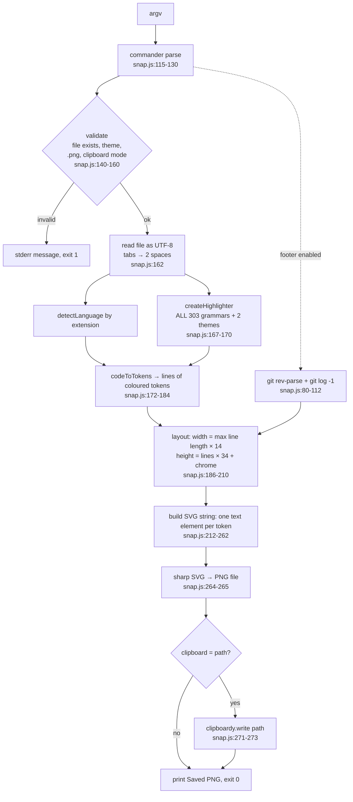

# Architecture

SnapCode is a single ES module, `src/snap.js` (285 lines), run as a Node CLI (`"type": "module"`, shebang on line 1, `bin.snap` in `package.json`). There are no other source files, tests, or build step.

## Dependencies and their jobs

| Package | Used for | Where |
|---|---|---|
| commander ^12 | argument and option parsing, `--help` | `snap.js:6, 115-130` |
| shiki ^1.24 (1.29.2 installed) | tokenising source into coloured spans | `snap.js:9, 167-183` |
| sharp ^0.33 | rasterising the SVG to PNG (via libvips/librsvg) | `snap.js:8, 265` |
| clipboardy ^4 | copying the output path | `snap.js:7, 272` |
| node:child_process | calling `git` for the footer | `snap.js:5, 85-103` |

## Modules (all in one file)

| Piece | Lines | Role |
|---|---|---|
| `EXT_TO_LANG`, `THEME_PRESETS` | 13-64 | static lookup tables |
| `escapeXml` | 66-73 | escapes `& < > " '` for SVG text |
| `detectLanguage` | 75-78 | extension → Shiki language id, fallback `plaintext` |
| `getGitBlameFooter` | 80-112 | returns footer string or `null` |
| `run` | 114-279 | everything else: parse, validate, highlight, lay out, build SVG, write PNG, clipboard |
| top-level `.catch` | 281-284 | prints `error.message`, exit 1 |

## Data flow

## How rendering works

1. **Tokenise.** Shiki returns, per line, tokens with `content` and `color`.
2. **Place.** Each token is a separate SVG `<text>` at `x += content.length * 14`, `y = codeY + row*34 + 24` (`snap.js:213-228`). This assumes a perfectly monospace font with a 14 px advance at 24 px font size.
3. **Frame.** The card (`rect`, rx 10), three traffic-light circles, file name, optional footer and a diagonal gradient background are plain SVG (`snap.js:239-262`). The drop shadow is an `feDropShadow` filter on the card group.
4. **Rasterise.** `sharp(Buffer.from(svg)).png().toFile(...)`. Fonts come from the host system; nothing is embedded.

## Key design decisions (as evidenced by the code)

- **SVG then rasterise** rather than a canvas or headless browser: small dependency set, but text metrics are guessed, not measured.
- **Fixed character grid** instead of font measurement: simple and deterministic in layout, but wrong for fallback fonts, wide characters and the whitespace issue (see audit F-03 to F-05).
- **All grammars preloaded** (`Object.keys(bundledLanguages)`) so any extension works without lazy loading logic; costs about 3.9 s per run (audit F-02).
- **Git via `execFileSync` with argument arrays** and a `--` separator: no shell is involved, so file names cannot inject commands.
- **Footer failure is silent** (`catch` returns `null`): the footer is treated as decoration.
- **Fail fast with `process.exit(1)`** and one-line messages for validation; everything else falls through to the top-level handler.

## Extension points

None formalised. New themes mean adding an entry to `THEME_PRESETS` and to the `themes` array at `snap.js:168` (the two lists are maintained separately). New languages mean adding to `EXT_TO_LANG`.
