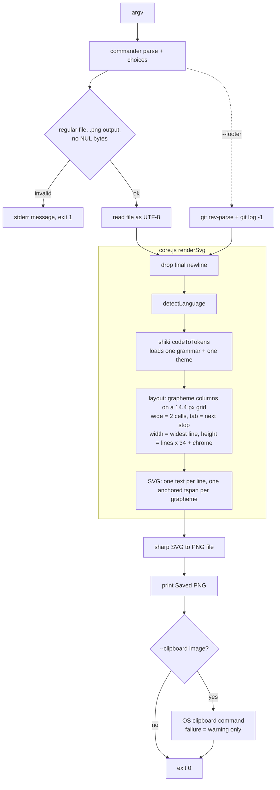

# Architecture

Two ES modules, no build step:

- `src/core.js`: pure renderer. Code + options in, SVG string out. Imports only `shiki`, so it also runs in a browser. It is the package entry point (`exports` in `package.json`).
- `src/snap.js`: the CLI (`bin.snapcode`). Parses arguments, reads the file, gets the git footer, calls `renderSvg`, rasterises with sharp, and optionally copies the image to the clipboard.

## Dependencies and their jobs

| Package | Used for | Where |
|---|---|---|
| shiki ^4 | tokenising source into coloured spans; language ids and aliases | `core.js` |
| commander ^15 | argument and option parsing, `--help`, `--version`, `choices` | `snap.js` |
| sharp ^0.35.5 | rasterising the SVG to PNG (via libvips/librsvg) | `snap.js` |
| node:child_process | `git` for the footer; OS clipboard commands | `snap.js` |

## Data flow

## How rendering works

1. **Tokenise.** Shiki's `codeToTokens` shorthand lazily loads only the requested grammar and theme and returns, per line, tokens with `content` and `color`.
2. **Place.** Each line is one `<text>` at `y = codeY + row*34 + 24`. Tokens are split into grapheme clusters (`Intl.Segmenter`), and each visible cluster is its own `<tspan x="codeX + col*14.4">` in the token's colour. `col` counts display cells: CJK, fullwidth and emoji take 2, everything else 1, and a tab jumps to the next multiple of `tabWidth` (default 4). Spaces only advance `col`. The widest line's column count sets the canvas width.
3. **Frame.** Gradient background, a soft shadow made of eight stacked translucent rounded rects, the card, three traffic-light circles, the file name and the optional footer. There is no SVG filter (an `feDropShadow` cost about 66 s on tall images).
4. **Rasterise.** `sharp(Buffer.from(svg)).png().toFile(...)`. Fonts come from the host system. Embedding one does not work: librsvg ignores `@font-face` (tested with a base64 TTF; the output was byte-identical).

## Key design decisions

- **SVG then rasterise** rather than a canvas or headless browser: small dependency set, and the same SVG can be shown directly in the web UI.
- **Glyphs on a fixed grid, not flowed text.** The installed font varies (Consolas advances 13.2 px at 24 px, Menlo and DejaVu Sans Mono 14.4), and librsvg supports neither `@font-face` nor per-character `x` lists, so every grapheme gets its own anchored `<tspan>`. Columns then match to the pixel in librsvg on every OS and in browsers; only glyph shapes differ. The cost is about 0.25 s on a 170-line file. Converting glyphs to paths from a bundled font would also make the shapes identical, but it needs a font parser in core and still needs a fallback for CJK and emoji.
- **Language detection defers to Shiki**: its ids and aliases cover most extensions; `FILENAME_LANG` and `EXT_LANG` hold only what Shiki lacks.
- **No shell anywhere**: `execFileSync` with argument arrays for git and clipboard commands; the Windows clipboard path goes through an environment variable.
- **Footer and clipboard failures never fail the run**: the footer is silently dropped, the clipboard prints a warning.
- **Fail fast with `process.exit(1)`** and one-line messages for validation; everything else falls through to the top-level handler.

## Extension points

- **Theme:** add an entry to `THEME_PRESETS` in `core.js`. The CLI's `--theme` choices read its keys, and Shiki loads the theme on demand.
- **Language:** usually nothing to do. If Shiki has the grammar but not the alias, add it to `EXT_LANG` or `FILENAME_LANG`.
