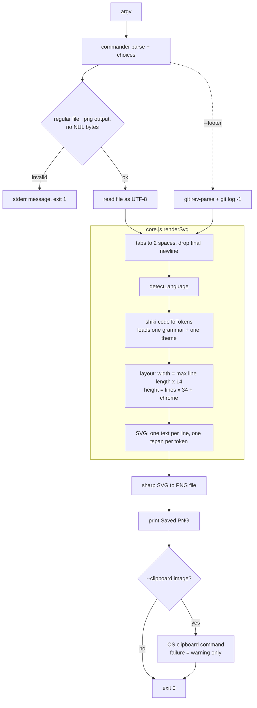

# Architecture

Two ES modules, no build step:

- `src/core.js`: pure renderer. Code + options in, SVG string out. Imports only `shiki`, so it also runs in a browser. It is the package entry point (`exports` in `package.json`).
- `src/snap.js`: the CLI (`bin.snapcode`). Parses arguments, reads the file, gets the git footer, calls `renderSvg`, rasterises with sharp, and optionally copies the image to the clipboard.

## Dependencies and their jobs

| Package | Used for | Where |
|---|---|---|
| shiki ^4 | tokenising source into coloured spans; language ids and aliases | `core.js` |
| commander ^15 | argument and option parsing, `--help`, `--version`, `choices` | `snap.js` |
| sharp ^0.35.5 | rasterising the SVG to PNG (via libvips/librsvg) | `snap.js` |
| node:child_process | `git` for the footer; OS clipboard commands | `snap.js` |

## Data flow

## How rendering works

1. **Tokenise.** Shiki's `codeToTokens` shorthand lazily loads only the requested grammar and theme and returns, per line, tokens with `content` and `color`.
2. **Place.** Each line is one `<text>` at `x = codeX`, `y = codeY + row*34 + 24`; each token is a `<tspan>` inside it, so horizontal spacing comes from the font. `xml:space="preserve"` on the root keeps leading and repeated spaces.
3. **Frame.** Gradient background, a soft shadow made of eight stacked translucent rounded rects, the card, three traffic-light circles, the file name and the optional footer. There is no SVG filter (an `feDropShadow` cost about 66 s on tall images).
4. **Rasterise.** `sharp(Buffer.from(svg)).png().toFile(...)`. Fonts come from the host system; nothing is embedded yet.

## Key design decisions

- **SVG then rasterise** rather than a canvas or headless browser: small dependency set, and the same SVG can be shown directly in the web UI.
- **Canvas width is still a guess** (`max line length x 14 px`); glyph positions within a line are not. Bundling and measuring a font is planned (PLAN.md step 4).
- **Language detection defers to Shiki**: its ids and aliases cover most extensions; `FILENAME_LANG` and `EXT_LANG` hold only what Shiki lacks.
- **No shell anywhere**: `execFileSync` with argument arrays for git and clipboard commands; the Windows clipboard path goes through an environment variable.
- **Footer and clipboard failures never fail the run**: the footer is silently dropped, the clipboard prints a warning.
- **Fail fast with `process.exit(1)`** and one-line messages for validation; everything else falls through to the top-level handler.

## Extension points

- **Theme:** add an entry to `THEME_PRESETS` in `core.js`. The CLI's `--theme` choices read its keys, and Shiki loads the theme on demand.
- **Language:** usually nothing to do. If Shiki has the grammar but not the alias, add it to `EXT_LANG` or `FILENAME_LANG`.
